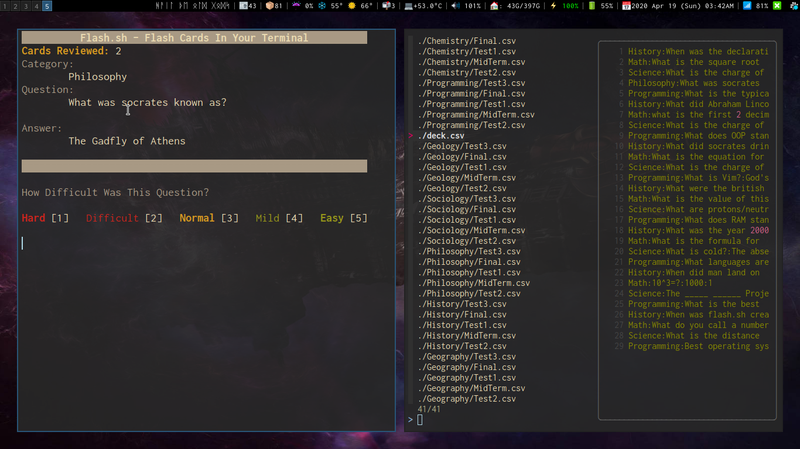

<!-- Header & Preview Image -->
<h1 align="center">

</h1>

<!-- Description -->
> flashcards in your terminal! This repository contains flashcard decks made by users of [flash.sh](https://github.com/tallguyjenks/flash.sh) for the purpose of sharing pre-made decks with others.

# Contributing

To contribute to this repository please read [CONTRIBUTING](./CONTRIBUTING.md)

In short the format is simple

The `deck.csv` file should have colon `:` separated values in 4 columns

Organized like this:

> `category:question:answer:0`

- **First Field:** _The category of the flashcard_
- **Second Field:** _The Question being asked_
- **Third Field:** _The Hidden Answer_
- **Fourth Field:** _The Score*_

> \* The score determines how often which cards are shown. A good idea is to start all of the cards out at 0 so they are all served to the user equally.

If your deck does not quite fit into one of the existing category folders, by all means file an issue or include a proper subject area directory with your pull request.

<!-- Footer Image -->
<h3 align="center">

</h3>

<!-- Shields -->

